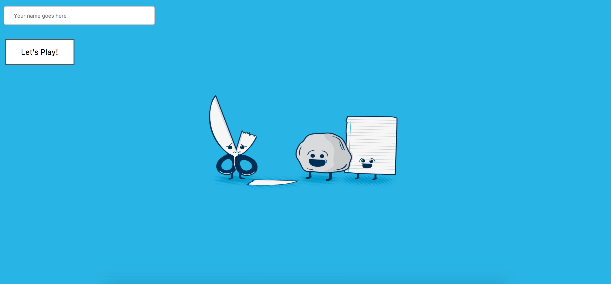
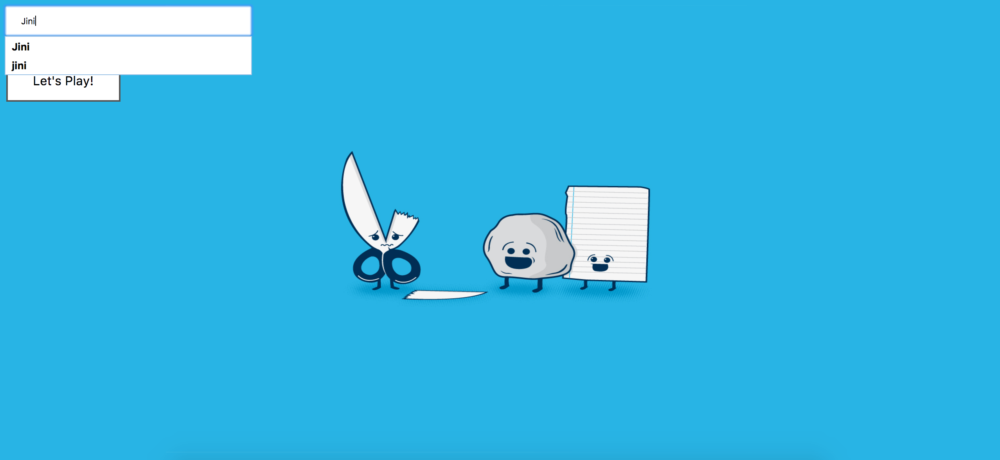
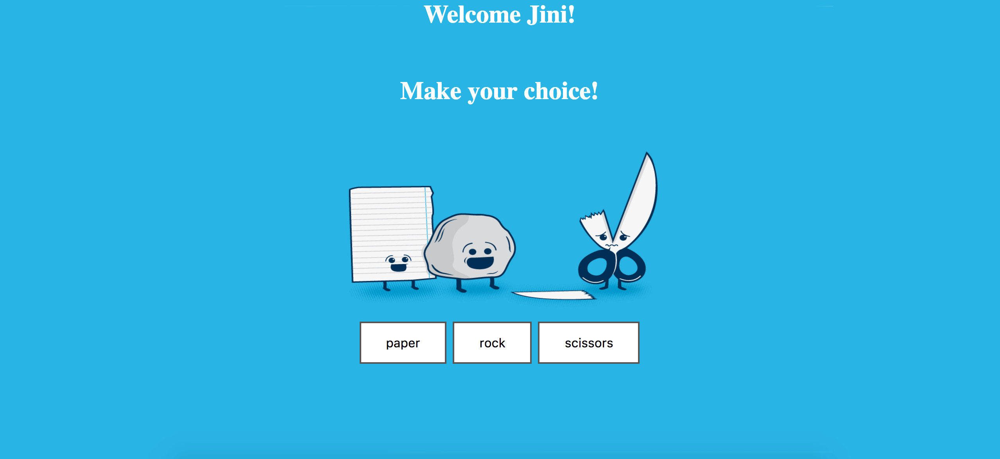
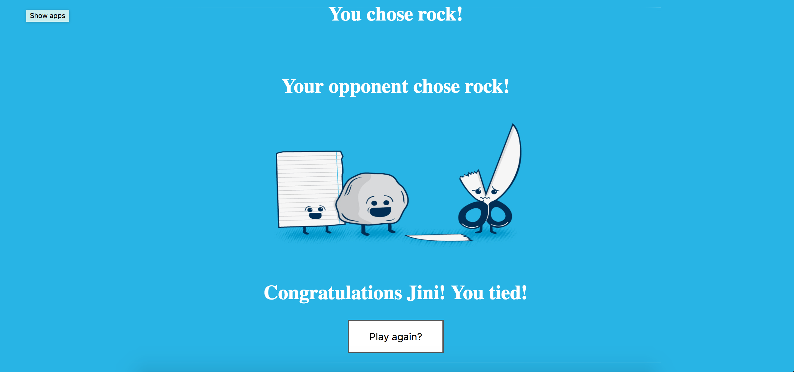

# RPS Challenge

A simple rock, paper, scissors app

```
As a marketeer
So that I can see my name in lights
I would like to register my name before playing an online game

As a marketeer
So that I can enjoy myself away from the daily grind
I would like to be able to play rock/paper/scissors
```

Basic Functionality

- the user should be able to enter their name before the game
- the user will be presented the choices (rock, paper and scissors)
- the user can choose one option
- the game will choose a random option
- a winner will be declared

## Installation

- Clone this repo to your local computer
- Navigate to the repo `cd <repo name>`
- Run `gem install bundle` from the command line
- Run `bundle` from the command line

## Connecting to local server

- Run `rackup` from the command line
- Navigate to `http://localhost:9292`

### Current coverage
COVERAGE: 100.00% -- 133/133 lines in 9 files











