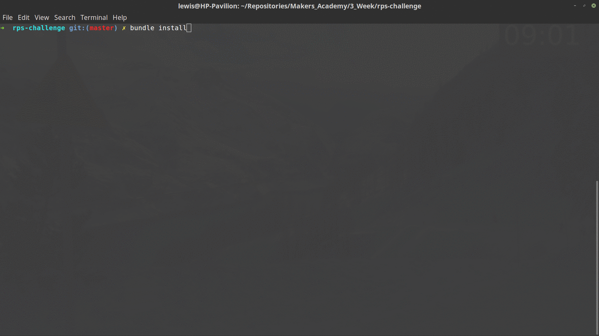

# RPS Challenge

[Task](#task) | [Approach](#approach) | [Execution](#execution) | [Struggles](#struggles) | [Demo](#demo) | [Technologies](#technologies)

## <a name="task">Task</a>

This task was completed as the weekend challenge for week 3 at Makers Academy. Following two weeks of learning how to test drive the development of Ruby programs and an instroduction to web technologies we were asked to develop a rock paper scissors game that could be played in the browser. The player can sign in, pick their weapon of choice. The computer will then do the same and a winner will be declared. Below are the user stories we were given.

```
As a marketeer
So that I can see my name in lights
I would like to register my name before playing an online game

As a marketeer
So that I can enjoy myself away from the daily grind
I would like to be able to play rock/paper/scissors
```


## <a name="approach">Approach</a>

#### The Controller

I wanted to use this challenge to really cement my understanding of the Controller's purpose, for it to contain all of the required routes for my page and for it to be as skinny as possible. This has been achieved to the best of my ability and I am particularly proud of the fact that I have managed to remove the need for global variables, using class methods in their place.

#### Views

This project was also a great opportunity for me to enjoy building my front end skills using HTML and CSS. I have made my pages responsive using the Twitter Bootstrap Library and added custom images and styles.


## <a name="execution">Execution</a>

I have endeavoured to follow *Dont Repeat Yourself*, **DRY** and *Single Responsibility Principal*, **SRP**  at all times, extracting functions into private methods and using guard clauses where applicable. Edge cases have been accounted for through rigorous testing using doubles and method stubs in both unit and feature tests. Test classes are all run in isolation.

Feature testing of the pages is achieved through the use of Capybara and Selenium WebDriver.

## <a name="struggles">Struggles</a>

* Initially used an array to house possible outcomes but changed to use a hash.
* Standardising the method by which options were selected (user input or button clicks).
* Using ERB while still keeping my view code readable and concise.

## <a name="demo">Demo</a>

Change into the required directory and run `bundle install`. You can then run `rackup` to start the local server and Following this navigate to your browser of choice and enter your the port on which you are hosting. Now get battling!

<div width="600px">
	<a>
		
	</a>
</div>


# <a name="technologies">Technologies</a>

Development was entirely test driven using Ruby 2.4.1 and RSpec testing framework. Rubocop was used to ensure standardised code formatting. To facilitate the sending of texts following the completion of an order the Twilio API and ruby gems were used. The Sinatra web framework along with ERB was used to develop the web application. Capybara and Selenium-WebDriver were used to automate browser feature tests.
