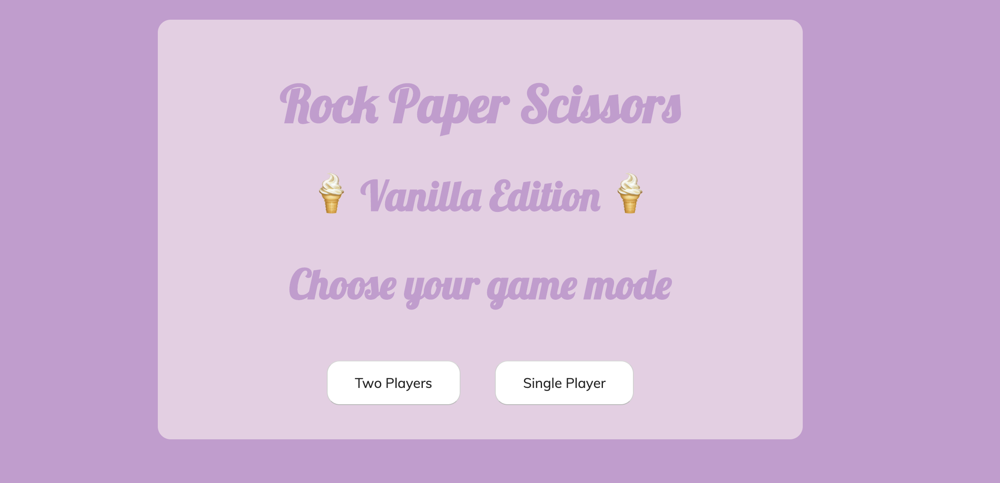

# RPS Challenge

Rock/paper/scissors web-app built on Sinatra and tested with Capybara/Rspec.


Tags: OOP, TDD, Ruby, HTML, CSS, Sinatra, MVC, RSpec, Capybara

Get started
----
```
$ git clone git@github.com:[USERNAME]/rps-challenge.git
$ cd rps-challenge
$ bundle
$ rackup
```
How to play
----
Begin by cloning the directory, then runing `bundle install` to install required gems. Use `rackup -p 4567` to host the game from your machine. The game can then be played from `localhost:4567/`.

Start the game by entering your name. Next, select your weapon and then press 'Go!' when ready to go into battle. The computer will select a weapon at random and a winner will be declared.

Domain Model
-----

The web-app is built on Sinatra and the design is based on an MVC architecture:

<pre>
Controller & Router (app.rb)  
          |  
          |<----------> Model (game.rb --> player.rb)  
          |  
          |
          |<----------> View (HTML with embedded Ruby)
                          |
                          |
                          |<---------------> CSS (to add styling on your browser)

</pre>   

The Ruby classes are designed around the principle of single responsibility - only the Game class is instantiated in the Controller, and the Game class delegates player-related information to the Player class.

The program was built test-first using Capybara and RSpec (Capybara allows the user stories to be feature-tested). As with all good OOP testing, the models are tested in isolation. All randomness is stubbed to ensure consistency of test results.

User stories
----
```
As a marketeer
So that I can see my name in lights
I would like to register my name before playing an online game

As a marketeer
So that I can enjoy myself away from the daily grind
I would like to be able to play rock/paper/scissors
```



