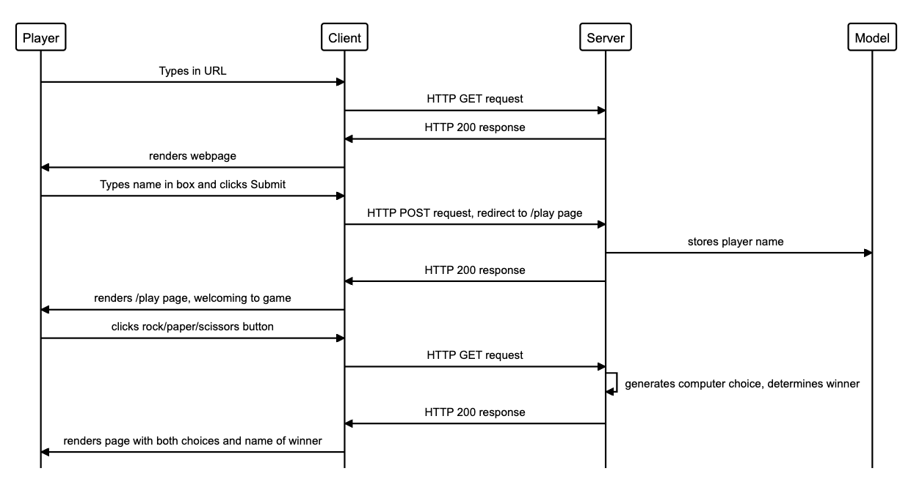

# RPS Challenge

The Makers Academy Marketing Array ( **MAMA** ) have asked us to provide a _Rock, Paper, Scissors_ game for them so they can play on the web.

## Motivation for the project

Weekend challenge for week 3 of Makers Academy.

## Skills Practised
Writing a simple web app, testing via Capybara & RSpec, incl mocking & doubles.

## How the code works
The user should ensure that they have installed the Gems listed in the Gemfile.

## Sequence diagram



## Challenge status & steps to finish
Planned game using a sequence diagram, set up README.  
To improve the README I would:
* add a paragraph describing set-up  
* add a run through  
To improve the code I would:  
* ???  
To extend the game I would:  
* Change the game so that two marketeers can play against each other  
* Extend the game to rock, paper, scissors, lizard, Spock.  

## User stories & working notes

```
As a marketeer
So that I can see my name in lights
I would like to register my name before playing an online game
```
Notes:
- the marketeer should be able to enter their name before the game

```
As a marketeer
So that I can enjoy myself away from the daily grind
I would like to be able to play rock/paper/scissors
```
Notes:
- the marketeer will be presented the choices (rock, paper and scissors)
- the marketeer can choose one option
- the game will choose a random option
- a winner will be declared

## Basic Rules

- Rock beats Scissors
- Scissors beats Paper
- Paper beats Rock
