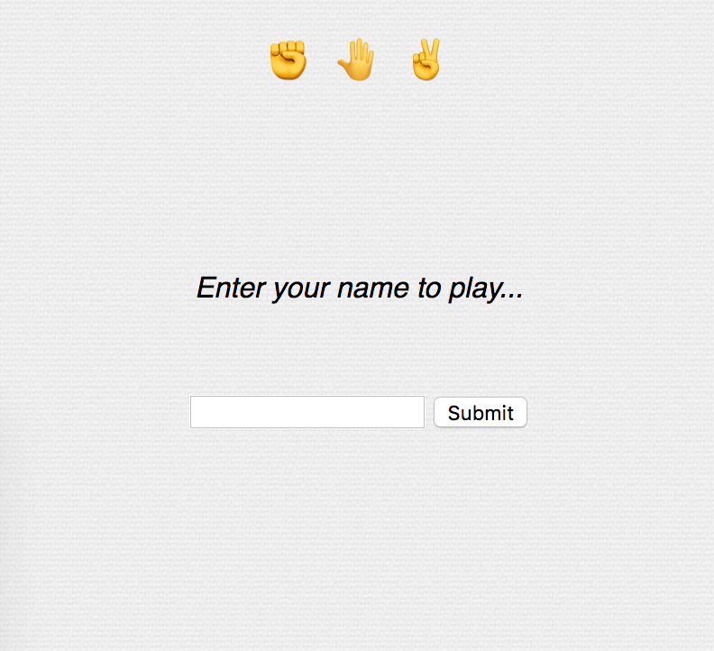
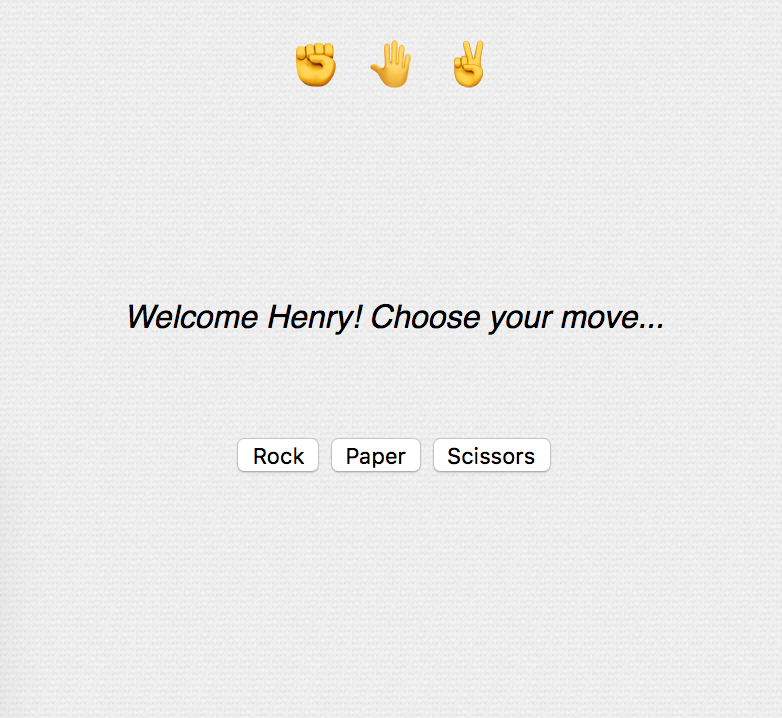
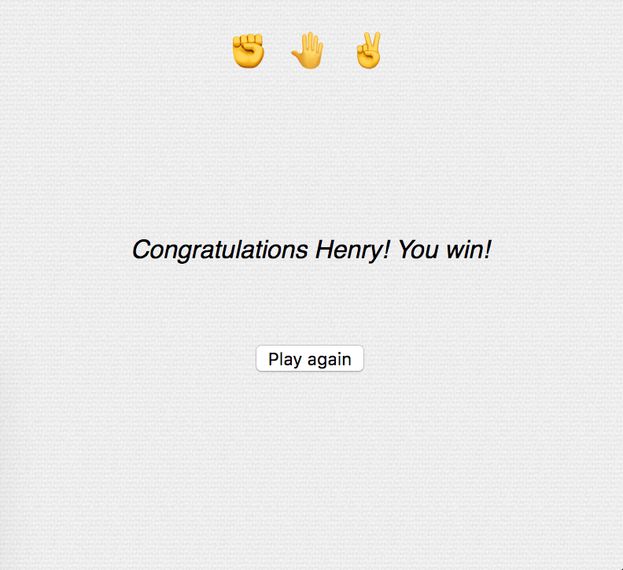

# RPS Challenge

###### _by Henry Cooksley_

Challenge: Make a playable rock-paper-scissors game using Ruby and Sinatra.

### Installation

Download or clone to your local machine. Then run `bundle` to make sure you have all the necessary dependencies installed.

```shell
$ bundle
```

### Usage

To run the server, just run rackup:

```shell
$ rackup
```

You should see that the rackup server is running on e.g. port 9292 (check the output to make sure).

Then you can view the app by pointing your browser to `localhost:9292`.

### Screenshots






