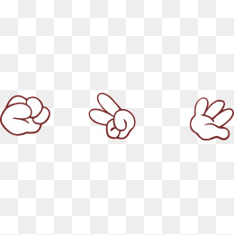

### Rock Paper Scissors

 
###### The idea
A web browser game, built with Ruby, based on HTTP and response-request mechanisms, using the Sinatra library, and Capybara/Rspec for testing.

###### Game capabilities:

A Player can:
- [x] register their name before playing an online game
- [x] play rock/paper/scissors

_functionality:_
- [x] enter their name before the game
- [x] will be presented the choices (rock, paper and scissors)
- [x] can choose one option
- [x] the game will choose a random option
- [x] a winner will be declared

###### Built with

Ruby, Sinatra, HTML, CSS

<<<<<<< HEAD
###### Visit
_[rock-ps.herokuapp.com](https://rock-ps.herokuapp.com/)_

###### Views
 &nbsp;  &nbsp; 
=======
###### How to run
[link tba](link)
>>>>>>> 7aca4d3ae9cb527cf87b4f882f0d2f72e275e21f

###### Testing
* Feature testing with Capybara: `git clone`, `bundle`, and `rackup`
* Unit testing with Rspec on command line: `rspec` to see the test results
* Browser view/test [here](https://rock-ps.herokuapp.com/)

###### notes
<<<<<<< HEAD
This was the 3rd weekend exercise; completed, but will revisit to improve. 
* I watched Sam Morgan's video walkthrough to help navigate the game building exercise.
 

To revisit for:
- [ ] better layouts / media queries
- [ ] custom font for emojis

###### Collaborators
_solo_ [Myrtle](https://github.com/Mrtly) ☺
=======
This was the 3rd weekend exercise; completed but will revisit to improve! 
* I watched Sam Morgan's video walkthrough to help navigate the exercise.
 
To revisit: 

- [ ] For better layouts / media queries
- [ ] Custom font for emojis

###### Collaborators
_solo_ [Myrtle](https://github.com/Mrtly) 
>>>>>>> 7aca4d3ae9cb527cf87b4f882f0d2f72e275e21f
