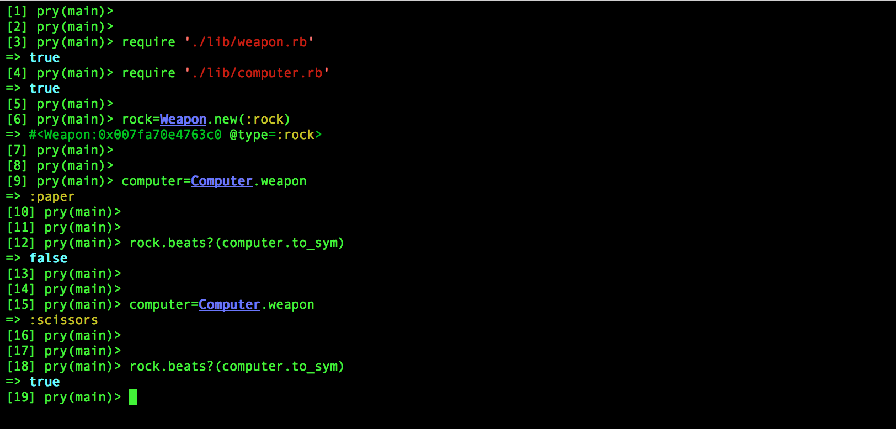

# RPS Challenge

specifications
--------------

Develop a web based _Rock, Paper, Scissors_ game.

In this game a player plays against a computer.  Following rule applies.

rock beats scissors
scissors beats paper
paper beats rock

Thus when player chooses one of the three the computer then chooses one of its own.  Based on above rule a winner is declared.  If player and computer both choose same then its a tie.

User Story
----------

    As a marketeer
    So that I can see my name in lights
    I would like to register my name before playing an online game

    As a marketeer
    So that I can enjoy myself away from the daily grind
    I would like to be able to play rock/paper/scissors
    ```

Below points are part of the functionality

- the marketeer should be able to enter their name before the game
- the marketeer will be presented the choices (rock, paper and scissors)
- the marketeer can choose one option
- the game will choose a random option
- a winner will be declared

Approach
--------
* two classes designed to cover the functionality
  * a weapon class creates a weapon (rock/scissors/paper)
  * computer class creates weapon randomly

* rules class defines who can beat whom

* Three views have been defined
  * index.erb - where player register's with their name
  * game.erb - where player chooses one of rock, scissor or paper
  * result.erb - declares who is winner - player or computer
  * when both choose same weapon its declared as tie
  * result.erb also shows cumulative score

A test run is as below
----------------------




Following are screen shots from a test-run
------------------------------------------


[](https://travis-ci.org/makersacademy/rps-challenge)
[](https://coveralls.io/r/makersacademy/rps-challenge)
