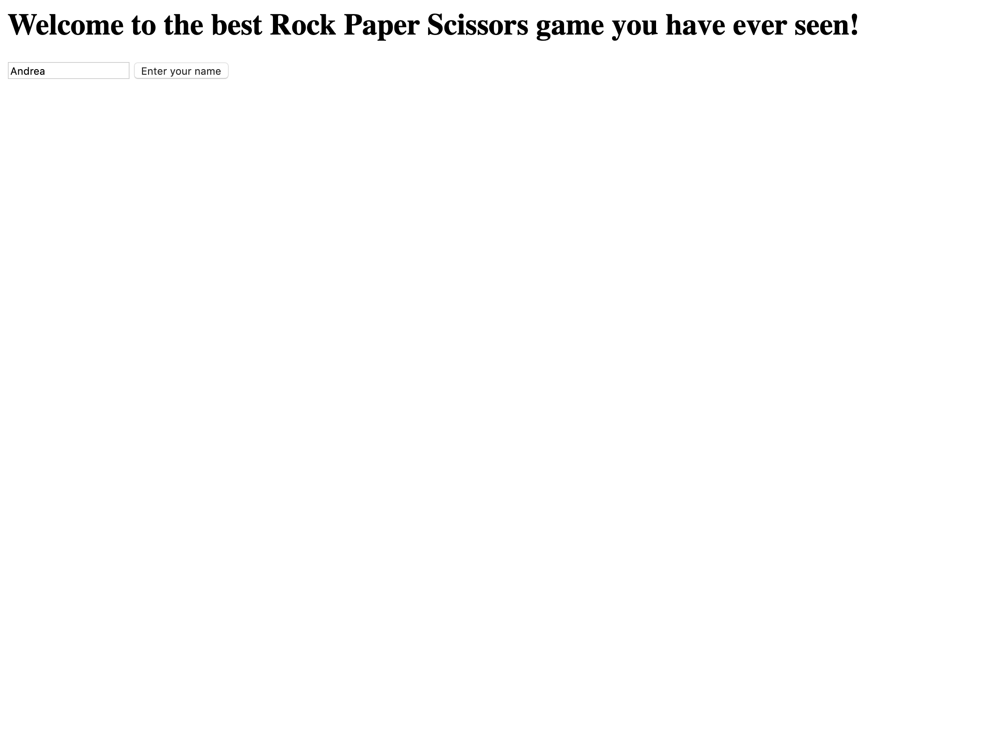
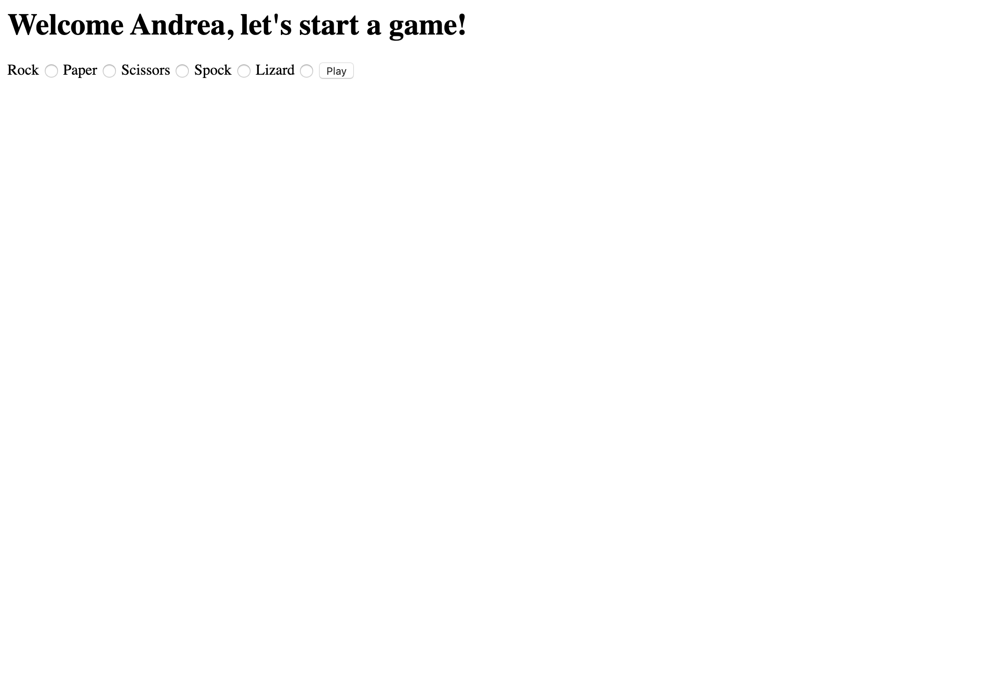
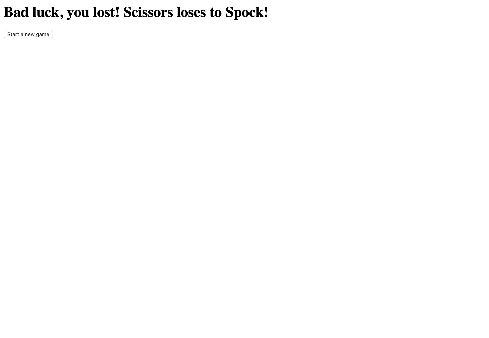
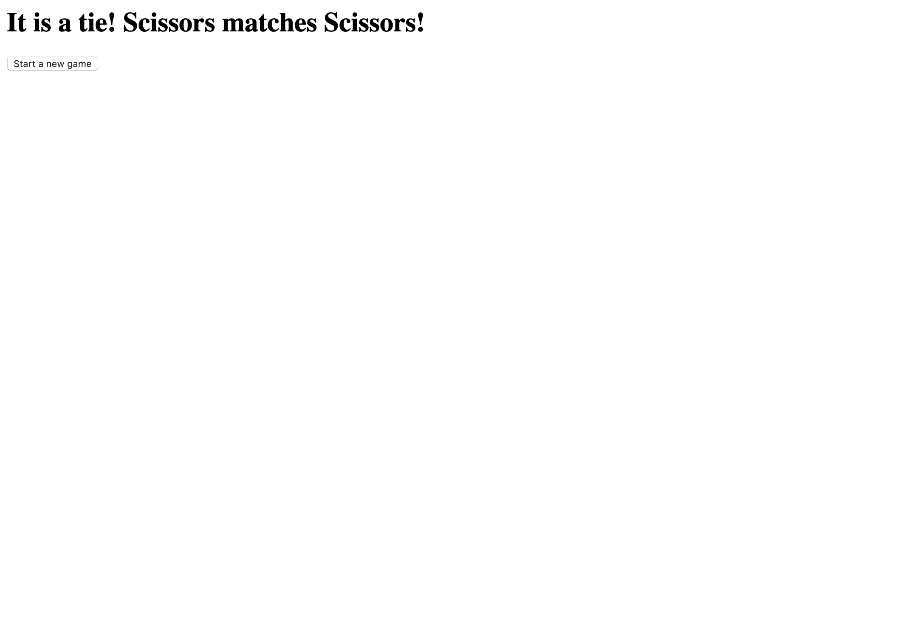
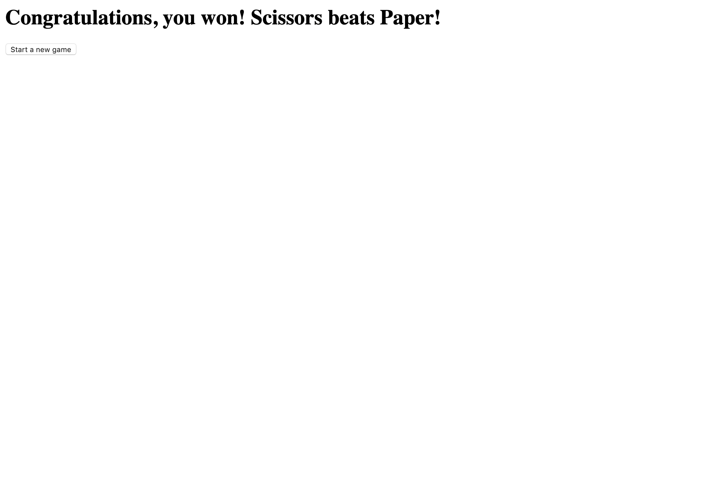

# RPS Challenge

Description
-------

This is the weekend challenge at the end of my third week at Makers Academy, a 16-week software developer bootcamp. For the main instructions, please refer [here](https://github.com/makersacademy/rps-challenge/blob/master/INSTRUCTIONS.md).

Prerequisites
-------

* Clone this repository into your machine with ```git clone```
* Change into the new repository

How to run tests
-------

* Run ```bundle``` to install all the dependencies
* Run ```rspec``` in the terminal to run the tests

Class Diagrams
-------

| Player                | Computer      | Game                         |
| ---                   | ----          | ---                          |
| @name                 | @choice       | @player                      |
| @choice               |               | @computer                    |
|---------------------- | ------------- | ---------------------------- |
| update_choice(choice) | random_choice | result                       |
|                       |               | update_player_choice(choice) |
|                       |               | update_computer_choice       |

Feature Test
-------

Run from the terminal: ```ruby app.rb```

Open in the browser the following URL: http://localhost:4567/


Enter your name inside the form and press the "Enter your name" button



Welcome page to a new round of the Rock Paper Scissors game with additional Spock and Lizard weapons



Choose a weapon and press the button "play"


A lost result!



Press the button "Start a new game" and play again. A tie result!



Press the button "Start a new game" and play again. A win result!


