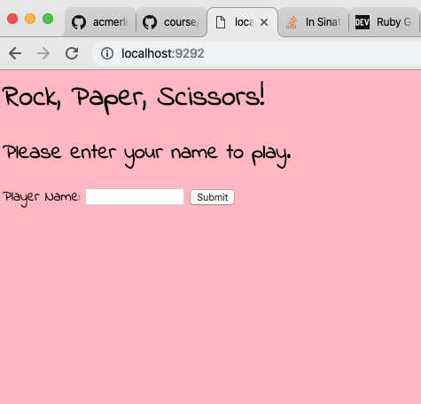

# RPS Challenge
[](https://travis-ci.com/camjw/rps-challenge)
[](https://codecov.io/gh/camjw/rps-challenge)

This repository is a Ruby/Sinatra implementation of the following user stories:

```sh
As a user
So that I can see my name in lights
I would like to register my name before playing an online game

As a user
So that I can enjoy myself away from the daily grind
I would like to be able to play Rock/Paper/Scissors/Lizard/Spock
```

This implementation supports one player and two player games.

The engine for the game is handled by four classes: `Player`, `RandomPlayer`,
`Game`, and the `VictoryGenerator`. The `Player` holds a players name and move,
the `RandomPlayer` randomly and uniformly generates a move from the five
possibilities, the `Game` stores two players and interfaces with the app and the
`VictoryGenerator`, which checks who has won and how they won (e.g paper COVERS
rock).


## The rules of the game

Rock Paper Scissors Lizard Spock is an extension of the usual game of Rock Paper
Scissors, and is a great improvement since the probability of a draw drops from
one third to one fifth!

The rules are as follows:


## Usage

To play the game first clone this repository.
```sh
git clone https://github.com/camjw/rps-challenge.git
```

To run the tests move to the directory the repository has been cloned to and run `rspec`.


There are 26 tests, which are all passing, with 100% coverage of the lib files and feature tests for the web features.

To see the repository in action first install the dependencies (just Sinatra for actually running the app) by running
```sh
bundle install
```
and then load the webpage by running
```sh
rackup config.ru -p 4567
```
Navigating to `localhost:4567` in your web browser will then allow you to play the game.

## Example
After racking up the website we can view the home page:


If we decide to play a two player game we can enter the player names (this is similar to the one player version).


Next, Billy can choose which move he wants to play (he chooses Lizard). There will also be a similar screen for Barry which is omitted. Barry foolishly chooses Spock.


Since Lizard poisons Spock, Billy wins. Billy and Barry can choose to play another game.


## Contributing

If anyone wants to update this repository to feature an implementation of Rock Paper Scissors Lizard Spock Wizard Glock (which has only a one seventh chance of a draw), I would be very happy to receive a pull request.
