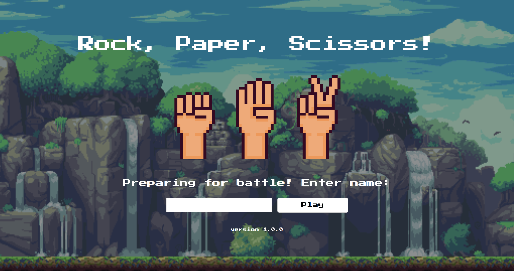

[](https://coveralls.io/github/awye765/rps-challenge?branch=master) [](https://travis-ci.org/awye765/rps-challenge)

<h1>Rock Paper Scissors: Makers Academy Week 3 Solo Project</h1>

<p align="center">
  
</p>

<h1>Project Aim</h1>

To create a basic interactive web application that fulfils the following user stories:

```sh
As a marketeer
So that I can see my name in lights
I would like to register my name before playing an online game

As a marketeer
So that I can enjoy myself away from the daily grind
I would like to be able to play rock/paper/scissors
```

<h2>Project functionality</h2>

<h3>Basic</h3>

- the player should be able to enter their name before the game
- the player will be presented the choices (rock, paper and scissors)
- the player can choose one option
- the game's computer AI (Ava the robot) will choose a random option
- a winner (or draw) will be declared and the scores of each party updated

<h3>Advanced</h3>

- Change the game so that two human players can play each other.
- Include option (and functionality) to play extended rock-paper-scissors-lizard-Spock rules (http://en.wikipedia.org/wiki/Rock-paper-scissors-lizard-Spock)

<h2>Instructions</h2>

**Installation instructions**
```sh
$ git clone git@github.com:awye765/rps-challenge.git
$ cd rps-challenge
$ bundle
```

**Running the app**

* Start app by typing **ruby app.rb** into terminal


* Go to http://localhost:4567/


**Playing the app**

* Press the start button



* Type your name into the text box and press submit


* Screen tells you the starting scores of each player, including the computer (Ava the robot)


* Choose your gesture by clicking on the relevant icon/button


* Next screen tells you your move and score, the computers move and score, and who won


* A new turn can be initiated by clicking "Next Turn", which returns to the gesture selection screen with updated scores


