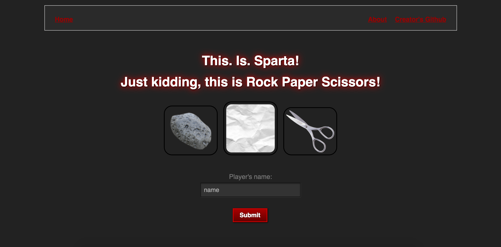
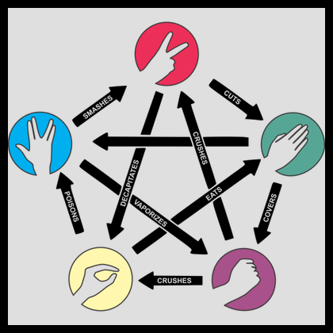

# Rock Paper Scissors (Spock, Lizard) Challenge
```
    _______
---'   ____)
     (_____)
     (_____)
      (____)
---.__(___)

    _______
---'   ____)____
          ______)
         _______)
         _______)
---.__________)

    _______
---'   ____)____
          ______)
      __________)
      (____)
---.__(___)
```

Task
----

The Makers Academy Marketing Array ( **MAMA** ) have asked us to provide a game for them. Their daily grind is pretty tough and they need time to steam a little.

Task is to provide a _Rock, Paper, Scissors_ game for them so they can play on the web with the following user stories:

```
As a marketeer
So that I can see my name in lights
I would like to register my name before playing an online game

As a marketeer
So that I can enjoy myself away from the daily grind
I would like to be able to play rock/paper/scissors
```

## Instruction to use the app
- git clone https://github.com/Unicornelia/rps-challenge
- bundle install
- ruby lib/app.rb


## Interface




Hints on functionality

- the marketeer should be able to enter their name before the game
- the marketeer will be presented the choices (rock, paper and scissors)
- the marketeer can choose one option
- the game will choose a random option
- a winner will be declared

## Bonus level 1: Multiplayer

Change the game so that two marketeers can play against each other ( _yes there are two of them_ ).

## Bonus level 2: Rock, Paper, Scissors, Spock, Lizard



Use the _special_ rules ( _you can find them here http://en.wikipedia.org/wiki/Rock-paper-scissors-lizard-Spock_ )

## Basic Rules

- Rock beats Scissors
- Scissors beats Paper
- Paper beats Rock
