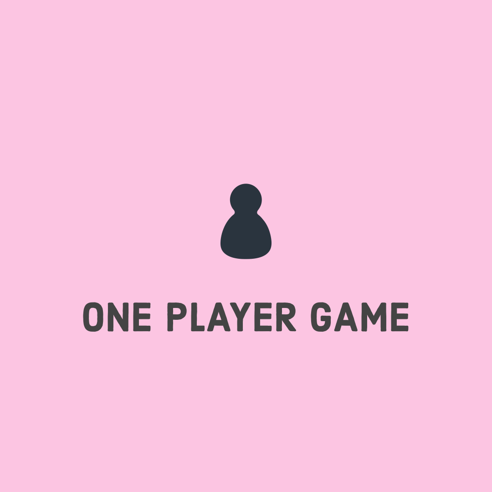

# Rock Paper Scissors Challenge

Tasks
-------
* To build a RPS game which we can play online against a computer.
* Add a Multiplayer feature.
* Expand the game to include Spock and Lizard.

RPS against a computer (Single-player)
----
Please do the following to start and play the game in irb:


PRS - Multiplayer
----
The instructions are below.


Include Spock and Lizard
----
Both the Single-player and the Multiplayer allow to add the Spock and Lizard as an additional feature. Simply create a GamyType class and add it to the Game (create an Option class for the computer) or Multiplayer classes and you are ready to go.

Play Online
---
Simply run ```rackup``` in the command line.


Then go to ```http://localhost:9292/```, enter your name and press 'Submit'.


Select whether to play against a computer or to have a multiplayer game.


Make your choice by clicking on 'rock','paper' or 'scissor'.


You will see the result on the next page. Press 'Play again' if you want to have another game.

