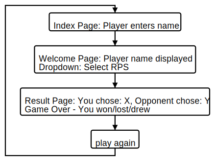

# RPS Challenge

Task
----

This involved the creation of a  _Rock, Paper, Scissors_ game in sinatra and ruby, with the following user stories:

```
As a marketeer
So that I can see my name in lights
I would like to register my name before playing an online game

As a marketeer
So that I can enjoy myself away from the daily grind
I would like to be able to play rock/paper/scissors
```

As part of the planning process I created the below diagram to map out the steps and journey taken by the player;



Progress & Next Steps
----

- The user stores are satisfied in this challenge
- The code does include global variables which are not best practice so the next step would be to refactor to remove these
- The result method inside the game class is too long with the use of conditionals and also needs to be refactored
- I would like to add some more CSS styling to the views by using a style sheet
