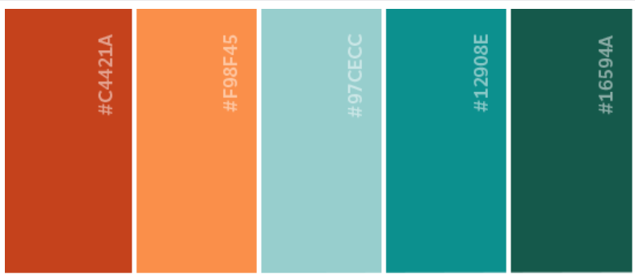

# Rock Paper Scissors Challenge


<br />

The Makers Academy Marketing Array ( **MAMA** ) have asked us to provide a game for them. Their daily grind is pretty tough and they need time to steam a little.

Your task is to provide a _Rock, Paper, Scissors_ game for them so they can play on the web with the following user stories:

```
As a marketeer
So that I can see my name in lights
I would like to register my name before playing an online game

As a marketeer
So that I can enjoy myself away from the daily grind
I would like to be able to play rock/paper/scissors
```

## Functionality

- the marketeer should be able to enter their name before the game
- the marketeer will be presented the choices (rock, paper and scissors)
- the marketeer can choose one option
- the game will choose a random option
- a winner will be declared

<br />

## Design Choices

Being a very visual person, I was really excited for this challenge, as I could dig out my half forgotten HTML and CSS skills.
Unfortunately I haven't managed to make my design visible, therefore I hosted a second repo on Github Pages for anyone who'd like to see it in action.
You can find the link at the end of this markdown.

<br />

### **Color Palette for Inspiration:**




### **Buttons:**

First drafts were selfmade buttons in Photoshop. I then switched during the process to fully in CSS styled buttons.

   

<br />
<br />


## **My Webdesign Process**

First draft (Photoshop & Codepen):


Final design:


## **View the finished design here (Preview 1st page only):**
## https://nadinedelia.github.io/rps-design/
