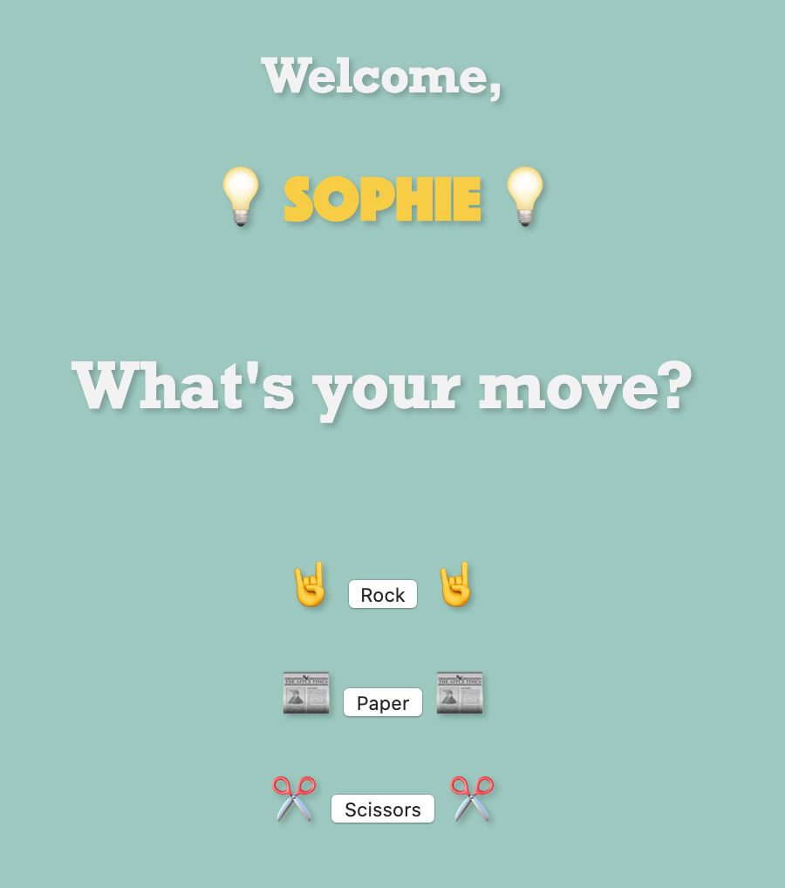

# RPS Challenge
<center>


⬇️



⬇️


</center>

User Stories
----

```
As a marketeer
So that I can see my name in lights
I would like to register my name before playing an online game

As a marketeer
So that I can enjoy myself away from the daily grind
I would like to be able to play rock/paper/scissors
```

## The usual basic rules of RPS:

- Rock beats Scissors
- Scissors beats Paper
- Paper beats Rock

## Criteria to be met:
✅ All RSPEC and Capybara tests passing.\
✅ High [Test coverage](https://github.com/makersacademy/course/blob/master/pills/test_coverage.md) (>95% is good)\
✅ The code is elegant: every class has a clear responsibility, methods are short etc.
