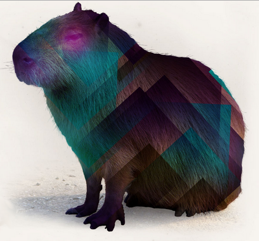

<div align="center">

### rock_paper_scissors


## single player


## multi player


&nbsp;

<h3>STACK</h3>

|                                                        | Tool                                                 | Use?                                       | Where can I see it?                                                  |
|--------------------------------------------------------|------------------------------------------------------|--------------------------------------------|----------------------------------------------------------------------|
|        | [RSpec](https://rspec.info/)                         | Testing tool for Ruby.                     | In game_spec.rb - tests pure Ruby code.                              |
|     | [Capybara](https://github.com/teamcapybara/capybara) | Acceptance test framework for Ruby.        |  In spec/features - testing for expected features.                   |
|         | [Ruby](https://www.ruby-lang.org/en/)                | Programming language.                      | Everywhere!                                                          |
|       | [jQuery](https://jquery.com/)                        | Small, feature rich Javascript library.    | In the sublte animations on the RPS buttons.               |
|  | [Animate.css](https://animate.style/)                | CSS library for animations.                | Fading animations and 'click anywhere to start again'. |
|      | [Sinatra](http://sinatrarb.com/)                     | DSL for quickly making web apps with Ruby. | In the file structure for the project - it is built on Sinatra.      |


</div>

## Install
Try it out in your browser [here](https://arthur-r-p-s.herokuapp.com/).

Or to install:
``` bash
% git clone https://github.com/arthurfincham/rps-challenge
```

## Usage

Go to the project directory and install dependencies:

``` ruby
% bundle install
 ```

Run the app with Sinatra
``` ruby
% ruby app.rb
```
and you're off!
