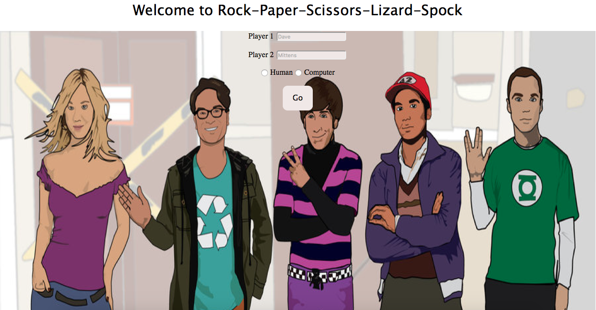
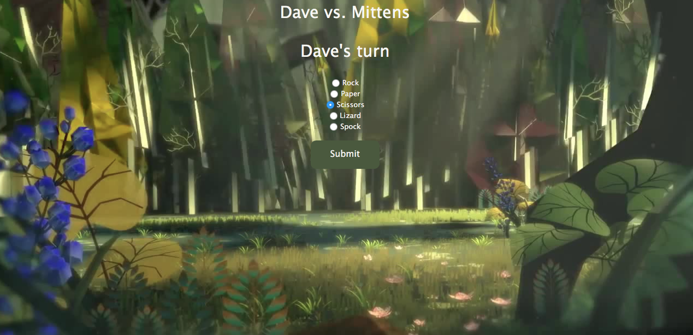
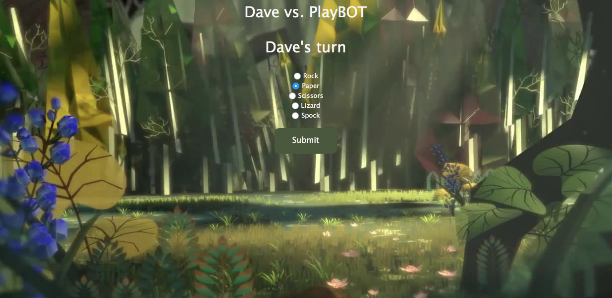

## Weekend 3 - RPS Challenge

First, I drew the process flow diagram to get my head around how the controller should route. Second, I identified that I will be needing Player class and Game class which will handle most of the logic for the game. I wrote tests and started implementing my plan. Once the MVP was reached, I decided to improve the layout of my web pages. Finally, I decided to implement the additional feature of including 'lizard' and 'spock' options to the 'Rock-Paper-Scissors' game.

## Contributor
- Ashwini Mani

## Bahaviors practised
- [BDD](https://github.com/makersacademy/course/blob/master/pills/bdd_cycle.md)
- [OOP](https://en.wikipedia.org/wiki/Object-oriented_programming)

## Framework
- Sinatra

## Technologies Used
- Rspec
- Ruby
- Capybara

Screenshots:

  

  

  

  

