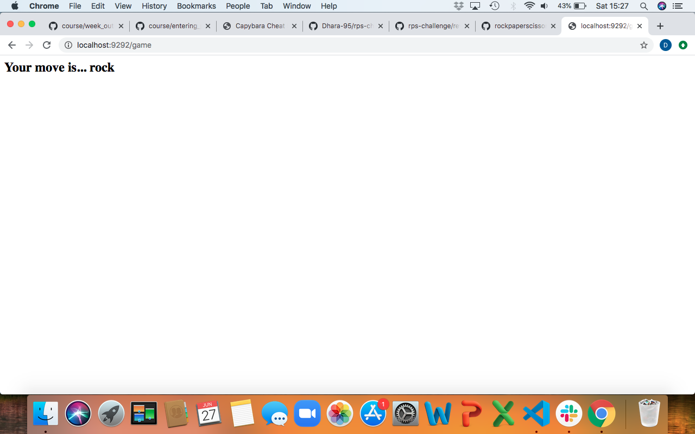

# RPS Challenge

**User Stories**
----

```
As a marketeer
So that I can see my name in lights
I would like to register my name before playing an online game - COMPLETE

As a marketeer
So that I can enjoy myself away from the daily grind
I would like to be able to play rock/paper/scissors - STARTED BUT NOT COMPLETE
```

**Running the App**
----

$ git clone https://github.com/Dhara-95/rps-challenge
$ cd rps-challenge
$ bundle install
$ rackup 
- use localhost:9292 in web browser

**RPS App images**
----
(the screenshots of the web app pages can be found in the 'screenshots' directory within this repo)

*User story 1:*


*User story 2:*




**What next?**
----

I started writing code that selects a computer move at random and stores it in an empty instance variable @comp_move. I would complete this challenge by writing code that prints a result, on another route, of "win", "lose" or "draw" based on the player's move and the randomized computer move. There would then be a button to redirect you back to the homepage to start a new game if you wish. 