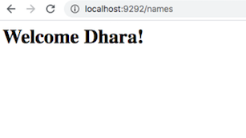

# RPS Challenge

**User Stories**
----

```
As a marketeer
So that I can see my name in lights
I would like to register my name before playing an online game - COMPLETE

As a marketeer
So that I can enjoy myself away from the daily grind
I would like to be able to play rock/paper/scissors - COMPLETE
```

**Running the App**
----

$ git clone https://github.com/Dhara-95/rps-challenge

$ cd rps-challenge

$ bundle install

$ rackup -p 9292

- navigate to 'localhost:9292' in web browser

*100% Test Coverage*

**RPS App images**
----
(the screenshots of the web app pages can be found in the 'screenshots' directory within this repo)

*User story 1:*




*User story 2:*


**What next?**
----

Overall really enjoyed this challenge and helped me to further understand the req/resp cycle. I would like to continue to refactor my code to enable sessions as well as combine some CSS code for formatting the app. An additional functionality could also be added to allow two players to play the game, rather than one player vs the computer. 
