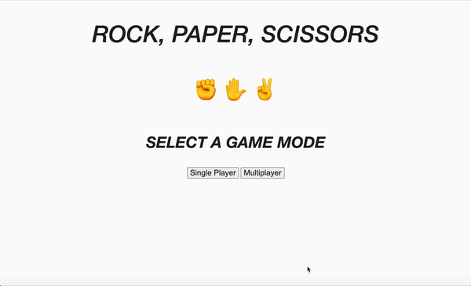
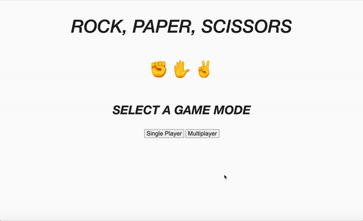
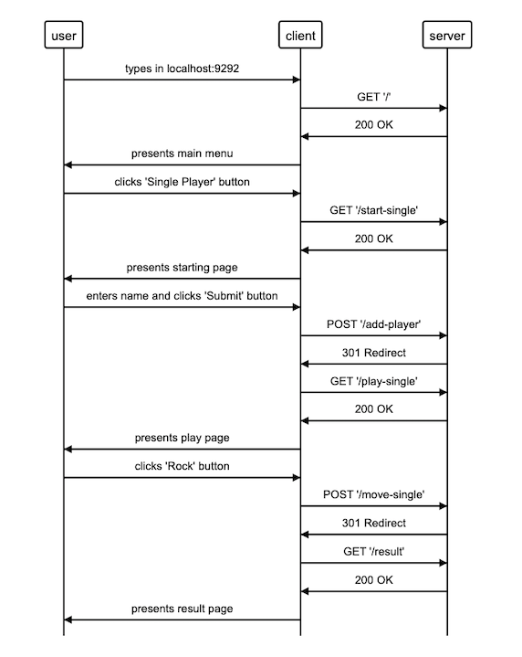
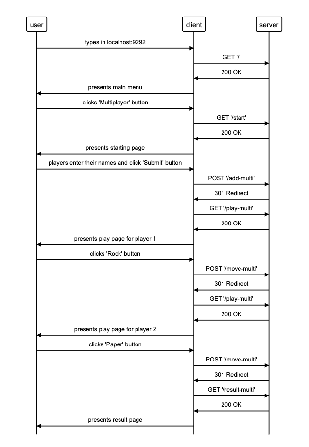

# RPS Challenge

## Summary of Challenge
- Create a web application that allows a user to register their name
- Allows the user to play a game of rock paper scissors
- Has both a single player and multiplayer mode [optional]

## How To Use
```
# on Terminal
$ rackup
```
```
# in browser
http://localhost:9292
```
## Game Demo
### Single Player Game Demo


### Multiplayer Game Demo


## User Stories
```
As a marketeer
So that I can see my name in lights
I would like to register my name before playing an online game

As a marketeer
So that I can enjoy myself away from the daily grind
I would like to be able to play rock/paper/scissors
```
## Domain Modelling
### Sequence Diagram of Game in Single Player Mode


### Sequence Diagram of Game in Multiplayer Mode


## Considerations

- One of the main considerations of this challenge was how to correctly implement the Model-View-Controller software pattern. In particular I struggled to get the balance right between keeping the controller skinny and managing the high number of routes and `.erb` files. For example, the `/play` and `/play-multi` routes for displaying the game page are relatively similar in functionality. They could in theory be combined into one route, as could the `/play_single.erb` and `/play_multi.erb` files - but this would also require functions and if statements to be implemented into the controller and `.erb` files in order to display the correct content or redirect to the correct routes. I'm still unsure of how to combine routes and `.erb` files without introducing complex functions into the controller.
- I was also not confident in carrying out feature tests in capybara in the presence of random elements (i.e. the move played by the computer in single player mode being randomly selected in each game). I ended up using the `srand()` function to predict which move selection would be made ahead of time -  but I am still not sure how to generally "mock" behaviour in a feature test in the same way that I do in unit tests.
